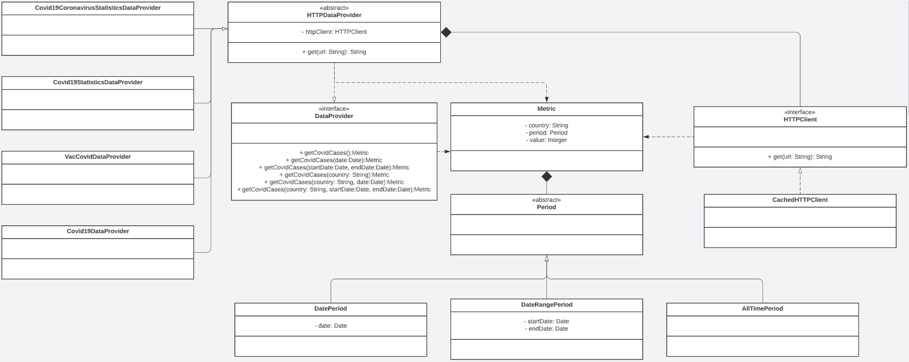

# Covid Data Web Application

## Objectives

The aim of this work is to develop a multi-layer web application providing information about Covid cases worldwide. Said application must come with automated tests.

This application will be able to gather information from different sources, transforming data as required so as to offer a transparent access. So as to reduce the amount of requests to the external sources their responses must be stored in a temporary cache.
  
 

## Technologies

The frontend will be developed using the Angular framework. Its development will follow a behavior driven approach, making use of the Cucumber framework and Selenium.

The API will be developed in Spring Boot following a test-driven approach. The tests will be written using the built-in utilities, Junit5 and Mockito. The cache will be stored in a Redis database, logs will be provided by Logback, and requests to external sources will be handled with the help of OkHttp. The development process will be accompanied by SonarQube to ensure the quality of the code.
  
 

## API Planning

The API must allow gathering the number of Covid infections, filtering by country, date or date range. The application will have the ability to gather data from four different sources: [Covid-19](https://rapidapi.com/api-sports/api/covid-193/), [VacCovid](https://rapidapi.com/vaccovidlive-vaccovidlive-default/api/vaccovid-coronavirus-vaccine-and-treatment-tracker/), [Covid-19 Statistics](https://rapidapi.com/axisbits-axisbits-default/api/covid-19-statistics/) and [Covid-19 Coronavirus Statistics](https://rapidapi.com/KishCom/api/covid-19-coronavirus-statistics/). 

It is also required from the API to provide data about the Cache mechanism.

To support all the use cases, the following endpoints will be required:

**GET** /covid/cases 
Parâmetros:
- **date**: “dd-mm-yyyy”
- **start_date**: “dd-mm-yyyy”
- **end_date**: “dd-mm-yyyy”

**GET** /covid/cases/<country: string> 
Parâmetros:
- **date**: “dd-mm-yyyy”
- **start_date**: “dd-mm-yyyy”
- **end_date**: “dd-mm-yyyy”

**GET** /metrics/cache

The architecture for the data gathering will be the following:

With this decisions made, the next steps will be creating basic skeletons of each class, creating the tests, and iterating through each with a “red-green-refactor” mindset.
  
 

## Frontend Planning

Given the simplicity of the API, the frontend only needs to have a simple page, giving access to the filters country, date, start_date and end_date and a button to submit it so as to see the desired result.

